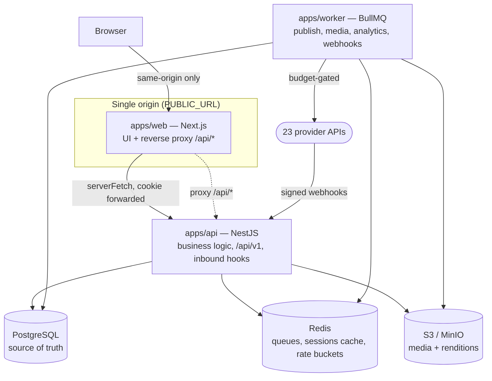
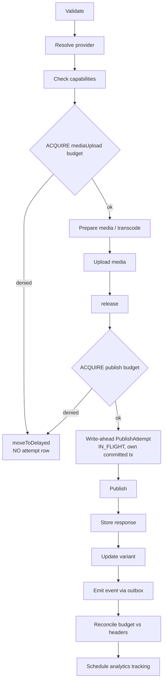
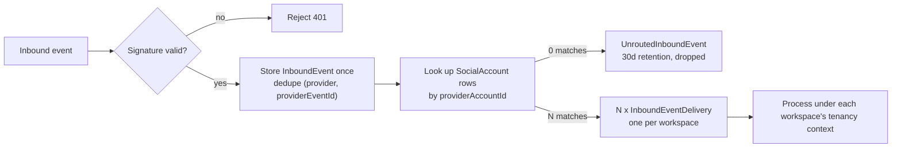

# ARCHITECTURE

Companion documents: `DATABASE.md`, `PROVIDERS.md`, `API.md`, `SECURITY.md`, `TASKS.md`.

## Evidence markers

`[V]` verified — **must cite a source URL and retrieval date**. `[A]` assumed. `[U]` unknown, must be checked before code depends on it. <!-- evidence-gate:ignore -->

A `[V]` without a URL and date is an assumption wearing a badge. CI enforces this (`scripts/gate-evidence-markers.mjs`). <!-- evidence-gate:ignore -->

---

## 1. Runtime topology



**Three processes, one image, three entrypoints.** An `all-in-one` target supervises all three for single-container deployments; the cost is roughly 150–250 MB additional RSS and the loss of independent worker scaling. Documented rather than hidden.

### Why `apps/api` is a separate service

The public REST API is a first-class product surface with its own auth mode (scoped API keys), versioning, rate limits and generated OpenAPI. NestJS provides guards, interceptors, DTO validation and Swagger natively. The worker imports the same `packages/*` domain code, so there is exactly one implementation of every rule.

- *Rejected — Next.js route handlers only:* hand-rolled OpenAPI, API-key auth and RBAC guards, and the public API becomes either a drifting second surface or an awkward retrofit onto handlers designed for a UI.
- *Rejected — tRPC internally plus a separate public REST:* two surfaces, guaranteed drift, double the authorization audit.

### Invariant: one origin

**`apps/web` reverse-proxies `/api/*` to `apps/api`.** Next.js rewrites in development and single-container; an ingress rule in SaaS. The browser only ever talks to one origin.

This is load-bearing. Same-origin eliminates CORS entirely, makes `SameSite=Lax` sufficient for CSRF, permits the `__Host-` cookie prefix, and makes the self-hosted and SaaS topologies behave *identically* rather than differing in precisely the area that is hardest to debug.

> **Do not move the API to `api.example.com`.** The CSRF posture in `SECURITY.md` depends on this invariant. Breaking it requires re-deriving that posture first.

---

## 2. Monorepo

```
apps/
  web/       Next.js App Router — dashboard, composer, calendar, inbox, analytics, admin
  api/       NestJS — business logic, /api/v1, inbound webhook receiver, OpenAPI
  worker/    BullMQ processors
packages/
  database/       Prisma schema, client extensions (tenancy, soft-delete, encryption), migrations, seeds
  auth/           Sessions, argon2id, permission model, authorize()
  providers/      Per connector: capabilities.ts, limits.ts, media.ts, text.ts, adapter, errors, fixtures
    capabilities/ zero-dependency subpath — browser-importable (capabilities, media and text profiles)
  ratelimit/      Redis token buckets, Lua scripts, adaptive correction
  media/          ffmpeg profiles, transcoding, renditions, probing
  storage/        S3 abstraction, signed URLs, media relay, upload validation
  publishing/     State machine, status reducer, orchestration, idempotency, reconciliation
  ui/             shadcn-based shared components
  content/        Template variables and UTM tagging — pure, browser-importable
  observability/  Structured logging and the Prometheus registry
  config/         zod env schema, shared tsconfig and eslint, feature flags
```

**Three packages this plan named do not exist: `social`, `analytics` and
`notifications`.** They were scaffolded empty and stayed empty, because the code
they were meant to hold turned out to have exactly one consumer each and landed
there instead — account lifecycle in `apps/api/src/providers`, metric
normalisation in `apps/worker/src/metrics.ts`, notifications in
`apps/api/src/notifications`.

A package exists to let two consumers share an implementation. Where there is
one, it adds a build target, an export map and a version boundary in exchange for
nothing. They are deleted rather than left as placeholders: an empty package
named after a major subsystem reads as "packaged, not yet filled in" to everyone
who was not there, which is a claim about the architecture that is not true.

If a second consumer appears — a second process that must normalise metrics, say
— that is when the package earns its place. `content` is what that looks like:
the composer previews a rendered template and a tagged URL, the API writes them,
and a preview computed by different code from the thing it previews is not a
preview.

### Dependency rules — enforced by ESLint, failing CI

| Rule | Reason |
|---|---|
| `apps/web` must not import `providers` (except `capabilities/`), `database`, or anything touching credentials | Credentials must be *structurally* unable to reach the browser |
| `config` and `ui` import nothing internal | Keeps the leaves acyclic |
| `ratelimit` imports only `config` | It is consulted from three subsystems; it must not depend on any of them |
| `providers` must not import `database` or `publishing` | Adapters stay persistence-free, so they are testable against fixtures; the caller supplies account and credential data |
| `publishing` depends on `providers`, `ratelimit`, `media`, `database` — never the reverse | Keeps the pipeline the composition root |
| `apps/web` may import `@smm/providers/capabilities` and nothing else from `providers` | The subpath is dependency-free and browser-safe; the adapters load credentials |

---

## 3. Database architecture

PostgreSQL with Prisma, UUID v7 primary keys (time-sortable, index-friendly). Full entity list in `DATABASE.md`.

### Tenancy enforcement — two layers

**Primary: a Prisma client extension.** Intercepts every query against a tenant-scoped model and throws if no `workspaceId`/`organizationId` scope is present. It also applies the `deletedAt IS NULL` filter.

**Secondary: Postgres RLS** on the highest-risk tables (`Post`, `PostVariant`, `SocialAccount`, `OAuthCredential`, `MediaAsset`, `Conversation`, `Message`), driven by `SET LOCAL app.current_workspace`.

- *Rejected — RLS alone:* pooled connections make missed context easy, and violations surface as confusing empty results rather than loud errors.
- *Rejected — query guard alone:* a single `$queryRaw` bypasses it silently.

**Proven by tests, not convention.** The isolation suite **enumerates tenant-scoped models from the Prisma DMMF at test time**, creates two workspaces with data, and asserts every cross-tenant read is empty and every cross-tenant write rejected. Adding a tenant-scoped model without isolation fails CI automatically — nobody has to remember to write the test.

### The application must not connect as a superuser

`FORCE ROW LEVEL SECURITY` removes the table *owner's* exemption from RLS. It does nothing about a superuser or a role with `BYPASSRLS` — those ignore row security entirely.

The official `postgres` image creates `POSTGRES_USER` as a superuser, so the obvious `DATABASE_URL` made every policy silently inert while `pg_policies` still listed them all. This was caught by the isolation suite, not by review, because nothing in the configuration was wrong to look at.

Consequently: migrations run as the owner (`MIGRATE_DATABASE_URL`); the application connects as `smm_app_user`, an unprivileged login granted the `smm_app` privilege role. `assertRlsApplies()` runs at API boot and refuses to start if the connected role can bypass RLS.

### Soft-delete belongs in Phase 1

Once `deletedAt` exists, every tenant-scoped query must filter on it. Introducing it at Phase 9 would mean auditing eight phases of queries written without it — a retrofit that will miss cases. It goes into the tenancy extension from the start; Phase 9 keeps only the purge job, retention configuration and export.

### Invariant: transactions are database-only, short, and contain no I/O

`SET LOCAL` is transaction-scoped, which creates a fork where both obvious paths fail:

1. **Wrap the whole request in a transaction** so the setting persists — then a provider HTTP call inside holds a Postgres connection for its entire duration. A 30-second provider timeout pins a connection for 30 seconds; under load the pool exhausts and the deployment stalls, *presenting as a database problem that is actually an HTTP problem*.
2. **Use `SET` instead of `SET LOCAL`** so it persists on the connection — then it leaks to the next request that borrows that pooled connection. A silent cross-tenant data leak.

Resolution: tenant context is set per unit of DB work, not per request. Mechanically enforced:

```ts
// packages/providers/http.ts
export async function providerFetch(url: string, init: RequestInit) {
  if (txContext.getStore()?.active) {
    throw new TransactionBoundaryViolation(
      'Provider HTTP call inside an open DB transaction. ' +
      'Commit first; use the outbox for post-commit side effects.'
    )
  }
  // ...
}
```

The same guard covers S3 calls and non-transactional enqueues. This turns a latent production stall into a loud failure in the first test that makes the mistake.

Consequences worth recording so nobody "fixes" them back:

- **Never `SET`, always `SET LOCAL`.** A `$queryRaw` guard rejects session-level `SET` on tenant variables outright.
- **pgBouncer transaction pooling works** precisely because of this rule. This is a genuine benefit, not a workaround. Do not switch to session mode.
- **No `BYPASSRLS` on application roles.** Migrations and the admin console use a separate role. The worker is tenant-scoped exactly like the API.
- **Backstops:** `statement_timeout = 15s`, `idle_in_transaction_session_timeout = 10s`.

### Transactional outbox

Because provider calls cannot live inside a transaction, anything that must happen exactly once after a commit goes through an outbox: the domain write and the outbox row commit together, and a dispatcher drains the outbox into BullMQ. This closes the "committed the post, crashed before enqueueing" window that would otherwise leave a `SCHEDULED` row nobody ever picks up.

**Outbox delivery is at-least-once.** Stated explicitly because it is load-bearing: every outbox consumer must be idempotent, and that is a review checklist item for each new consumer.

---

## 4. Provider architecture

See `PROVIDERS.md` for the full interface and matrix. The architectural points:

### Capabilities: types for authoring, runtime for guarantee

Capabilities are declared in code in a zero-dependency subpath the browser may import, and served at runtime so the UI reflects operator configuration.

Conditional types bind adapter methods to capabilities for the *author*, but they have two limits: error messages at that composition depth are near-unreadable, and any code iterating the registry holds the widened union where conditional intersections collapse. Every real call site — inbox, publisher, analytics ingester — is exactly such a site. So runtime narrowing is the actual guarantee:

```ts
export function withCapability<K extends CapabilityKey>(
  adapter: AnyAdapter, cap: K
): asserts adapter is AnyAdapter & CapabilityMethods[K] {
  if (!adapter.capabilities[cap]) throw new UnsupportedCapability(adapter.provider, cap)
}
```

**Exhaustiveness:** `satisfies Record<CapabilityKey, boolean>` with no partials permitted. Adding a capability to the taxonomy breaks compilation across all 23 providers until each declares it — which is desired, because a silently-defaulted `false` on a provider that actually supports the feature is a permanently invisible gap.

### Constraints are keyed by surface, not by provider

Instagram feed images and Instagram Reels have incompatible rules. A single provider-keyed media profile would encode feed rules and reject every valid Reel. So `media.ts` and `text.ts` are keyed by *surface* — `feedImage`, `reel`, `story`, `carousel` — and live in the browser-importable subpath so the composer and the API validate identically. The same profiles double as the transcoder's target specifications.

### Reality anchors

Ten phases gated against `MockProvider` alone means the mock encodes our assumptions, and social APIs are largely a catalogue of ways those assumptions are wrong: publish is often two-phase and asynchronous, media is frequently *pulled* by the platform rather than pushed, "published" can be a container ID that later fails processing, rate-limit headers disagree with documented limits, error bodies are unstructured prose.

Filing platform applications early solves *access*. It does not solve *design validation*. Three self-service connectors therefore sit in the exit gates of the phases whose architecture they validate:

| Phase | Anchor | Validates |
|---|---|---|
| 4 — publishing | Mastodon | Real OAuth2 registration, async media processing, idempotency header, real rate-limit headers, real read-back for reconciliation |
| 6 — inbox | Telegram | Genuine inbound delivery, real DM semantics, real threading, a provider whose model does not match ours |
| 7 — analytics | Reddit `[A]` | Real polled metrics, real 429s under a token bucket, drifting counts, no insights API |

Each anchor produces a **divergence report** — every place the real provider disagreed with `MockProvider`, and whether we changed the mock, the interface, or the pipeline. An empty divergence report means the anchor was not exercised seriously. `MockProvider` is then corrected to match observed reality, so the mock becomes an artifact of evidence rather than of imagination.

---

## 5. Publishing and job architecture

### Scheduler: hybrid

**Postgres is the source of truth. Redis is transport.** A 30-second scanner claims due rows with `SELECT ... FOR UPDATE SKIP LOCKED` and enqueues immediate jobs. "Publish now" enqueues directly, bypassing the scanner.

- *Rejected — pure BullMQ delayed jobs:* Redis becomes the system of record for the content calendar. An eviction, flush or version migration loses scheduled posts silently, and every edit or reschedule requires job surgery racing a job already moving to active.
- *Rejected — pure scanner:* up to a full tick of latency on "publish now" reads as broken.

A job sits in Redis for at most ~30 seconds, so edits almost never race. Within that window the worker re-reads the row **inside the claiming transaction** and aborts if `scheduledAt` changed or status is no longer `SCHEDULED`/`QUEUED`.

**DST:** a stored `scheduledAt` is absolute UTC and is never rewritten. Only *recurrence expansion* is zone-aware — the next "weekdays 09:00 Europe/Berlin" is computed in that IANA zone at expansion time, so 09:00 stays 09:00 local across a DST boundary. Expansion runs on a rolling ~60-day horizon.

**Clock safety:** the scanner refuses to claim if system time moved backwards more than a few seconds since the previous tick, logging loudly instead. NTP corrections on self-hosted boxes are common, and a backwards jump would re-claim already-published rows — a duplicate-publish path that sits entirely outside the idempotency design, which reasons about retries rather than about time travel.

### Two state enums, one derived

A single enum covering both entities made `Post = PREPARING_MEDIA` representable and meaningless. `PARTIALLY_PUBLISHED` is inherently post-level; `PREPARING_MEDIA` and `NEEDS_REVIEW` are inherently per-variant.

**`VariantStatus` is authoritative**, written only by the pipeline:

```
DRAFT  SCHEDULED  QUEUED  PREPARING_MEDIA  PUBLISHING
PUBLISHED  FAILED  CANCELLED  MISSED  NEEDS_REVIEW
```

**`PostStatus` is derived** by one pure reducer, evaluated in precedence order:

| # | Condition | PostStatus |
|---|---|---|
| 1 | any variant `NEEDS_REVIEW` | `NEEDS_REVIEW` |
| 2 | all `CANCELLED` | `CANCELLED` |
| 3 | any `PUBLISHED` **and** any `FAILED`/`MISSED`/`CANCELLED` | `PARTIALLY_PUBLISHED` |
| 4 | all `PUBLISHED` | `PUBLISHED` |
| 5 | all `MISSED` | `MISSED` |
| 6 | all `FAILED` | `FAILED` |
| 7 | any `PUBLISHING`/`PREPARING_MEDIA` | `PUBLISHING` |
| 8 | any `SCHEDULED`/`QUEUED` | `SCHEDULED` |
| 9 | otherwise | `DRAFT` |

Any `NEEDS_REVIEW` wins outright: a possible duplicate needs a human before anything else is reported.

`PENDING_APPROVAL` and `APPROVED` are **`PostStatus`-only** editorial gates with no variant counterpart. They enter the enum in Phase 4 and sit **unused until Phase 5** ships approvals — stated explicitly so their absence from the Phase 4 flow is not mistaken for a gap.

The reducer is pure, lives in `packages/publishing`, and is unit-tested across the full cross-product of variant states.

### Pipeline



**Budget is acquired per operation, not per job.** A single acquisition before media prep would hold a `publish` token across a multi-minute transcode while never spending `mediaUpload` — a different operation class with its own quota. Renditions are cached keyed by `(assetId, providerProfile)`, so a `publish` denial never wastes a completed transcode.

**The invariant: budget before write-ahead.** A job denied by our own budget must not create an `IN_FLIGHT` attempt record, because to the reconciler that is indistinguishable from a job that may have reached the provider.

### Idempotency and reconciliation

1. **Deterministic key** per variant, `sha256(variantId || contentHash)`, stable across retries, sent as the provider's native idempotency header where one exists.
2. **Write-ahead attempt** committed in its own transaction before the provider call.
3. **Reconciliation, not blind retry.** A stale `IN_FLIGHT` triggers reconciliation: if the provider has `retrievePosts`, query recent posts in a bounded window and match. Found means `PUBLISHED` with the discovered remote ID; not found means retry is safe.

**Fingerprints must survive provider mutation.** Providers rewrite what you send — link shortening, unicode normalisation, whitespace trimming, truncation, appended attribution. Exact-text matching would fail reconciliation, report "not found", and produce the duplicate the whole mechanism exists to prevent.

The fingerprint is computed **before publish** over a deliberately stable subset: NFKC-normalised text with URLs stripped, whitespace collapsed, truncated to a safe prefix, plus media count and ordering, plus the authoring account ID. Matching is similarity within a bounded time window and author — never equality on full text.

**Where a provider offers no read-back, exactly-once is not achievable.** The variant moves to `NEEDS_REVIEW` and asks the user. This deliberately chooses *at-most-once plus human review* over *at-least-once plus duplicates*: a duplicate public post is unrecoverable and embarrassing, a review prompt is merely annoying.

### Rate budgeting

Reacting to 429s is not a rate-limit strategy — it burns quota to discover quota, and on providers that penalise sustained overage it is actively harmful. YouTube's roughly 6 uploads per day against a 10,000-unit quota cannot be handled reactively at all: by the time an error arrives the day's budget is spent.

`packages/ratelimit` is a Redis-backed distributed token bucket consulted before every outbound provider call by all three consumers (publishing, analytics ingestion, inbox polling). Key: `{provider}:{accountId}:{operationClass}` where class is one of `publish | mediaUpload | read | analytics | write`. Budgets ship in the provider directory — a connector arrives with its limits or it does not arrive.

`scope: 'app' | 'account' | 'both'` is explicit because both errors are real: per-app budgets applied per-account exhaust the app quota, and the reverse throttles everyone needlessly. With `scope: 'both'`, **a single Lua script checks and decrements both buckets atomically** — never two sequential acquisitions, which can partially succeed and leak tokens. All bucket operations are Lua.

**Two denial paths, never conflated:**

| | Local budget denial | Provider 429 |
|---|---|---|
| Attempt row | none created | exists, `IN_FLIGHT` |
| Action | `moveToDelayed(waitMs)` | honour `Retry-After`, mark `RATE_LIMITED` |
| Retry count | not incremented | not incremented — a 429 is not a failure |
| Bucket effect | none | multiplicative decrease, recover after cooldown |

**Adaptive correction:** on a 429, halve the account's refill rate for `recoverAfter`, then restore linearly; on sustained success, reconcile toward observed `X-RateLimit-Remaining`. Redis is authoritative; `ProviderRateState` is written every few minutes for observability only and never read on the hot path.

**Refund on abort:** budget acquired but never spent (media prep failed, variant cancelled) is refunded through the same Lua path. On YouTube's ~6/day, silent waste is a lost upload.

**Per-account concurrency mutex:** one publish in flight per social account, always. This prevents thread/reply ordering corruption and makes reconciliation tractable, since a stale `IN_FLIGHT` can only ever have one candidate. **The lease TTL must exceed the maximum provider timeout and carry a fencing token** — an expiring lock would reintroduce concurrency inside the very mechanism reconciliation depends on.

**Fairness:** acquisition is FIFO per key, so one workspace bulk-importing 500 posts cannot starve another on a shared deployment.

### Missed posts

| Age at claim | Action |
|---|---|
| within `catchUpWindowMinutes` (default 60) | Publish, set `publishedLate`, record `latenessSeconds` |
| beyond the window | `MISSED`, notify, require explicit user action |

`MISSED` is terminal with two user-initiated exits: publish now, or reschedule. It is never auto-retried, because the correct choice is editorial and we cannot make it.

Backlog claiming is oldest-first, batched, and budget-paced, so recovery from downtime is throttled like normal operation rather than being a self-inflicted denial of service. When the scanner finds more due rows than one tick can claim it emits `system.backlog` once per workspace — silence during recovery is worse than a warning.

### Queues

`publishing`, `media-processing`, `analytics-ingestion`, `analytics-aggregation`, `reports`, `notifications`, `webhooks-outbound`, `webhooks-inbound`, `outbox-dispatch`, `rss`, `token-refresh`, `purge`, `cleanup`.

Each with retries, exponential backoff, dead-letter states, locking, timeouts, and structured logs carrying request, job and attempt IDs.

---

## 6. Inbound webhooks

The inbox is not an outbound polling problem for the providers that matter. Meta delivers comments and DMs by webhook, Slack and Discord are event-driven, Telegram offers webhook or long-poll. These arrive as **unauthenticated public HTTP requests carrying another tenant's data**.

The queue naming collision is resolved: `webhooks-outbound` (deliveries we sign and send to customers) and `webhooks-inbound` (deliveries providers send us) share nothing — not auth, not retry semantics, not failure modes.

- **Endpoint:** `POST /api/v1/hooks/:provider`, plus `GET` for Meta's `hub.challenge` handshake. Exempt from session auth and the tenancy guard, because there is no user and no workspace yet. **Never exempt from signature verification.** 64 KB body cap, IP allowlist where the provider publishes ranges, per-source rate limiting.
- **Raw body preservation.** HMAC is computed over the exact bytes received. NestJS is configured `rawBody: true` and the verifier reads the raw buffer, never the parsed object. Re-serialising parsed JSON and hashing that is the single most common way this check silently passes on well-formed payloads and fails on everything else. A contract test asserts verification fails when a byte changes in a way JSON parsing would normalise away.
- **Acknowledge fast, process async.** Verify, write `InboundEvent`, enqueue, return 200. Target under 200 ms, hard budget 5 s. Meta disables subscriptions that respond slowly.

### Routing and fan-out



Because `SocialAccount` uniqueness is `(workspaceId, provider, providerAccountId)`, one provider event can be relevant to several workspaces — the agency case. The payload is stored once and fanned out to per-workspace delivery rows: one copy of the data, per-workspace processing state, and multi-routed events visible in admin rather than looking like duplicates.

Unrouted events are **dropped**, never guessed at, never broadcast, never attached to the nearest plausible workspace. Unrouted volume is an admin dashboard metric; a sustained rise means a stale subscription needs cleaning up.

> **This is the one place in the system where workspace context is derived from untrusted input.** It has its own section in `SECURITY.md` and its own isolation test: an event forged with another workspace's `providerAccountId` must not be routable without a valid signature from that provider's app.

- **Ordering:** per-conversation lock. Out-of-order arrival is expected; ordering uses provider timestamps, not arrival order. A message whose parent has not arrived is held briefly, then attached or promoted to a conversation root.
- **Gap recovery:** webhooks lose events. Every account carries a `SyncCursor`; a slow reconciliation poll runs on cadence and after every reconnect, deduplicated by the same unique index. This is also the path for providers with no webhook support, so **polling and webhook delivery converge on one write path rather than two**.
- **Ingress on self-hosted:** `INBOUND_MODE=poll|webhook|auto`, with `auto` probing `PUBLIC_URL` reachability at boot.

---

## 7. Media architecture

Upload goes to a presigned PUT against S3/MinIO, then `packages/media` probes it (sharp for images, ffprobe for video) and persists a `MediaAsset`.

**Renditions are per provider *surface*.** Instagram feed images require JPEG at aspect 4:5–1.91:1; Instagram Reels require MOV/MP4 with H264 or HEVC video, AAC audio at or below 48 kHz, 23–60 fps, closed GOP, 4:2:0 chroma, and the moov atom at the front of the file (`-movflags +faststart`). These are not variations of one profile — they are different targets.

Renditions are cached keyed by `(assetId, providerProfile)` and reused across posts. Transcoding runs in `media-processing` with its own concurrency limit, since ffmpeg is CPU-bound and will otherwise starve the publishing queue. Progress is written back to the variant while it sits in `PREPARING_MEDIA` — a variant stuck in `PUBLISHING` for six minutes with no explanation is an unreadable state.

### The Instagram pull problem

Instagram fetches media from a public HTTPS URL rather than accepting an upload. Many self-hosted deployments expose the app but not object storage.

`MEDIA_PUBLIC_MODE`:

| Mode | When | How |
|---|---|---|
| `presigned-s3` | Storage is itself internet-reachable | Presigned GET URL, fewest hops, no app bandwidth |
| `relay` | Only the app is public | `GET /api/v1/media/relay/:token` streams the object from S3 |
| `disabled` | Nothing is public | **Instagram is marked unavailable at boot, with the reason** |

The relay token is a short-TTL (30 min) HMAC capability resolving to **one specific rendition ID**. **There is no SSRF surface**, because the relay never accepts a URL — only an opaque token naming an object we already own. Security rests on token unguessability, TTL, single-asset scope and per-IP rate limiting. There is no auth, because Instagram's fetcher is anonymous.

---

## 8. Analytics architecture

Ingestion is background-only; nothing fetches from a provider on page load.

- **Post metrics** are polled on a decaying schedule after publish — 1h, 6h, 24h, 3d, 7d, 30d — appending a row each time. Engagement is front-loaded, so this captures the curve cheaply instead of polling everything hourly forever.
- **Account metrics** snapshot daily. **Audience insights** weekly, where offered.
- All ingestion passes through the rate budget, sharing quota with publishing and inbox polling.

**Storage shape:** normalized typed columns *and* `raw` JSONB on the same row. Normalized columns are nullable, and that is semantic — the UI must distinguish *zero* from *not reported by this platform*.

**Retention:** normalized metrics indefinite (subject to entitlement tier); `raw` nulled after 90 days; hourly granularity rolled to daily after 30 days; `AnalyticsSnapshot` daily rollups indefinite. **Dashboards query snapshots, never raw rows.**

- *Rejected — raw only, normalize at query time:* dashboards become unusably slow, and a provider changing its payload shape retroactively breaks historical charts.
- *Rejected — a separate raw table:* an extra join for no benefit; row-level retention is simpler as a nullable column.

---

## 9. API architecture

Full detail in `API.md`. Architecturally:

- **Versioned** at `/api/v1`, with OpenAPI generated from NestJS decorators.
- **Two auth modes, never blended.** Session cookie for the web app; `Authorization: Bearer smm_live_...` for API keys. A request presenting **both is rejected**, not resolved by precedence, and API-key requests never receive `Set-Cookie`. This is where public-API-plus-web-app products usually get owned via confused deputy.
- **Cursor pagination** for large collections; offset only where a total is genuinely needed.
- **Idempotency keys** accepted on all unsafe methods.
- **Consistent error envelope** carrying a machine code, a human message, and a request ID.

---

## 10. Security architecture

Full detail in `SECURITY.md`. The load-bearing pieces:

**Credential encryption.** AES-256-GCM envelope encryption behind a pluggable `KeyProvider`. A per-record DEK encrypts the token; the DEK is wrapped by a KEK. Stored ciphertext is `{ v, keyId, iv, tag, ciphertext }`, versioned so the scheme itself can change. Self-hosted custody is `ENCRYPTION_KEY` from env, and the app refuses to boot if it is absent, short, or the documented example value. SaaS backs the same interface with KMS or Vault. Rotation re-wraps DEKs while `ENCRYPTION_KEY_PREVIOUS` stays readable. Applied in a Prisma extension so no call site can forget.

**Cookie and TLS policy.** `__Host-` requires `Secure`, which requires TLS, and `localhost` is exempt — so a naive implementation passes in development and fails on the first internal LAN deployment.

| `PUBLIC_URL` | Cookie | Boot |
|---|---|---|
| `https://...` | `__Host-smm_session`, `Secure` | normal |
| `http://localhost...` | `smm_session` | normal, dev notice |
| `http://` other host | `smm_session` | **refuses unless `ALLOW_INSECURE_COOKIES=true`**, then warns on every boot |

Rejected making TLS a hard requirement, because LAN-only self-hosting behind a firewall is legitimate. Rejected silently downgrading, because a security property that disappears without saying so is worse than either explicit option.

**Server Components must forward cookies.** RSC has no ambient cookie jar; `apps/web/lib/server-fetch.ts` is the only sanctioned path, and an ESLint rule bans bare `fetch` to the API from `apps/web/app/**`. Forgetting this produces the classic "works in the browser, logged out on refresh" bug — worth a lint rule rather than a code-review habit.

---

## 11. Gates

Enforced by static check in CI, not by reviewer memory:

1. **No new tenant-scoped model without an isolation test** — the DMMF-driven suite fails on any unguarded model.
2. **No new outbound provider call without a declared rate budget.**
3. **No `[V]` marker without a source URL and retrieval date.** <!-- evidence-gate:ignore -->

Each phase additionally gates on type-check, lint, unit, integration and the relevant E2E flow.
