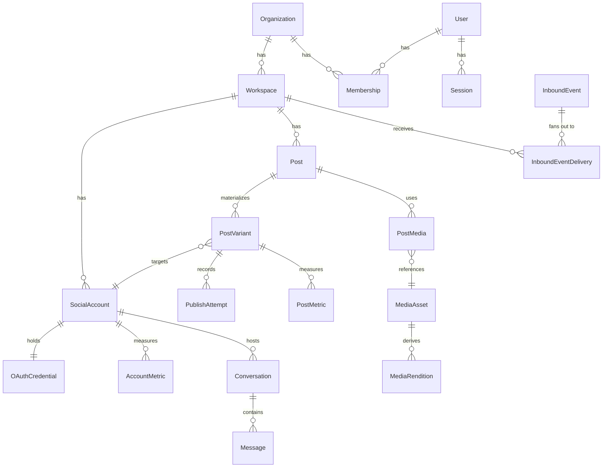

# DATABASE

PostgreSQL 17, Prisma, **UUID v7** primary keys (time-sortable, so they index and paginate well without a separate created-at sort key).

---

## 1. Conventions

| Rule | Detail |
|---|---|
| Primary keys | `id String @id @default(dbgenerated("uuid_generate_v7()")) @db.Uuid` |
| Timestamps | `createdAt`, `updatedAt` on every table |
| Soft delete | `deletedAt DateTime?` on every **tenant-scoped** table, filtered automatically |
| Tenancy columns | `organizationId` and/or `workspaceId` on every tenant-scoped table |
| Money / counts | integers; never floats |
| Enums | Postgres enums via Prisma, never free strings |
| Provider identifiers | always stored separately from internal IDs, never conflated |
| JSON | `Json` only where the shape is genuinely open-ended per provider, and always validated by a zod schema on write |

### Tenancy indexing rule

Every tenant-scoped table carries a **composite index leading with the tenancy column**:

```prisma
@@index([workspaceId, status, scheduledAt])
@@index([workspaceId, deletedAt])
```

Leading with `workspaceId` matters because every query is already filtered by it; an index that does not lead with it cannot serve those queries efficiently.

### Soft delete is Phase 1, not Phase 9

Once `deletedAt` exists, every tenant-scoped query must filter on it. Adding it later would mean auditing every query written before it existed. The Prisma client extension applies both the tenancy scope and `deletedAt IS NULL` from the beginning; the DMMF-driven isolation suite asserts soft-deleted rows are invisible to normal reads.

### Migration conventions

- One migration per logical change, named `YYYYMMDDHHMMSS_short_description`.
- **Expand/contract for anything destructive.** Add the new column, backfill, switch reads, then drop in a later migration — never in one step.
- `prisma migrate deploy` runs as a one-shot compose service before api/worker/web start, so first boot is a single command.
- Migrations run under a role **separate from the application role**; the application role never has `BYPASSRLS`.

---

## 2. Entity map



---

## 3. Identity and tenancy

**`Organization`** — `name`, `slug`, `plan`, `entitlements Json`. The billing and quota boundary.

**`Workspace`** — `organizationId`, `name`, `slug`, `timezone`, `settings Json`, `deletedAt`, `purgeAt`. The content and isolation boundary. `purgeAt` is set on soft delete and surfaced in the UI as an actual date, never as "soon".

**`User`** — `email` (citext, unique), `passwordHash` (argon2id), `name`, `avatarUrl`, `timezone`, `locale`, `emailVerifiedAt`, `anonymizedAt`. On user deletion the row is **anonymised, not cascaded** — content belongs to the workspace, so authorship becomes a tombstone and posts survive.

**`Membership`** — `userId`, `organizationId`, `workspaceId?`, `role`. Unique on `(userId, organizationId, workspaceId)`. A null `workspaceId` means org-wide.

**`Role`** enum: `OWNER, ADMIN, MANAGER, EDITOR, AUTHOR, APPROVER, ANALYST, CLIENT, VIEWER`.

**`Permission`** — resolved from role plus per-membership overrides; see `PRD.md` §5 for the grant matrix.

**`Session`** — `userId`, `tokenHash`, `expiresAt`, `lastSeenAt`, `ip`, `userAgent`, `revokedAt`. Authoritative in Postgres so sessions are listable and revocable; cached in Redis with a short TTL. Logout deletes the row and busts the cache, so revocation is immediate everywhere.

**`Invite`** — `organizationId`, `workspaceId`, `email`, `role`, `tokenHash`, `expiresAt`, `acceptedAt`, `invitedById`. Single-use. Accepting **joins** the existing organization; it never creates one.

---

## 4. Social accounts and credentials

**`SocialAccount`**

| Column | Notes |
|---|---|
| `workspaceId` | tenancy |
| `provider` | enum, 23 values |
| `providerAccountId` | the platform's own ID — never conflated with `id` |
| `handle`, `displayName`, `avatarUrl` | synced metadata |
| `surfaces Json` | which surfaces this account can post to (feed, reel, story, ...) |
| `platformMeta Json` | Mastodon instance URL + dynamic client credentials, Facebook page ID, IG business ID, Telegram chat ID, Pinterest default board, YouTube channel ID |
| `status` | `ACTIVE / NEEDS_REAUTH / DISCONNECTED / DISABLED` |

```prisma
@@unique([workspaceId, provider, providerAccountId])
@@index([provider, providerAccountId])   // inbound webhook fan-out lookup
```

> **Uniqueness is per workspace, deliberately.** Two workspaces may connect the same Facebook Page — an agency and its client both doing so is normal. A global unique constraint would forbid the agency case outright. The secondary non-unique index on `(provider, providerAccountId)` is what inbound routing uses to fan out.

**`OAuthCredential`** — `socialAccountId` (1:1), `accessTokenEnc`, `refreshTokenEnc`, `expiresAt`, `scopes String[]`, `keyId`.

Ciphertext is `{ v, keyId, iv, tag, ciphertext }`, AES-256-GCM envelope encrypted, applied by a Prisma extension so no call site can forget. **Credentials are hard-deleted on disconnect — never soft-deleted.**

---

## 5. Content

**`Post`** — the thing the author wrote once.

`workspaceId`, `authorId`, `status PostStatus` (**derived**, see below), `baseContent`, `campaignId?`, `scheduledAt` (UTC), `timezone` (IANA), `queueSlotId?`, `approvalId?`, `deletedAt`.

**`PostVariant`** — one row per target account. The load-bearing table.

| Column | Notes |
|---|---|
| `postId`, `socialAccountId` | |
| `surface` | `FEED / REEL / STORY / CAROUSEL / SHORT / ARTICLE` |
| `contentOverride`, `mediaOverride` | null means inherit from the post |
| `platformOptions Json` | validated by a per-provider zod schema on write |
| `status VariantStatus` | **authoritative** |
| `attempts`, `lastError`, `lastErrorCode` | |
| `idempotencyKey` | `sha256(variantId || contentHash)` |
| `fingerprint` | mutation-tolerant, computed **before** publish |
| `remoteId`, `remoteUrl`, `publishedAt` | |
| `publishedLate`, `latenessSeconds` | |
| `estimatedCostCents` | X charges per post; the composer shows this before scheduling |

```prisma
@@unique([postId, socialAccountId, surface])
@@index([workspaceId, status, scheduledAt])
@@index([socialAccountId, status])
```

> **Why rows and not a JSON blob.** Per-variant rows are required to filter ("failed LinkedIn posts this week"), to hold foreign keys to media, to carry per-variant status and attempts and idempotency keys, and to give partial success transactional integrity. A JSON blob makes variant status unindexable and turns partial-success updates into nested read-modify-write races. `platformOptions` *within* a variant stays JSON because it is genuinely open-ended per provider — relational where you query, JSON where you do not.

### Two status enums

**`VariantStatus`** (authoritative, written only by the pipeline):
`DRAFT, SCHEDULED, QUEUED, PREPARING_MEDIA, PUBLISHING, PUBLISHED, FAILED, CANCELLED, MISSED, NEEDS_REVIEW`

**`PostStatus`** (derived by a pure reducer in `packages/publishing`):
`DRAFT, PENDING_APPROVAL, APPROVED, SCHEDULED, PUBLISHING, PUBLISHED, PARTIALLY_PUBLISHED, FAILED, CANCELLED, MISSED, NEEDS_REVIEW`

Derivation, in precedence order:

| # | Condition over variants | PostStatus |
|---|---|---|
| 1 | any `NEEDS_REVIEW` | `NEEDS_REVIEW` |
| 2 | all `CANCELLED` | `CANCELLED` |
| 3 | any `PUBLISHED` and any `FAILED`/`MISSED`/`CANCELLED` | `PARTIALLY_PUBLISHED` |
| 4 | all `PUBLISHED` | `PUBLISHED` |
| 5 | all `MISSED` | `MISSED` |
| 6 | all `FAILED` | `FAILED` |
| 7 | any `PUBLISHING`/`PREPARING_MEDIA` | `PUBLISHING` |
| 8 | any `SCHEDULED`/`QUEUED` | `SCHEDULED` |
| 9 | otherwise | `DRAFT` |

Any `NEEDS_REVIEW` wins outright — a possible duplicate needs a human before anything else is reported.

`PENDING_APPROVAL` and `APPROVED` have **no variant counterpart**; they are editorial gates on the post alone. They exist in the enum from Phase 4 and are **unused until Phase 5** ships approvals. That is intentional, not an omission.

**`PublishAttempt`** — `postVariantId`, `idempotencyKey`, `status` (`IN_FLIGHT / SUCCEEDED / FAILED / RATE_LIMITED / RECONCILED`), `startedAt`, `finishedAt`, `providerRequestId`, `providerResponseId`, `errorCode`, `fenceToken`.

Written **before** the provider call, in its own committed transaction. A stale `IN_FLIGHT` row triggers reconciliation rather than a blind retry.

---

## 6. Media

**`MediaAsset`** — `workspaceId`, `storageKey`, `mime`, `bytes`, `width`, `height`, `durationMs`, `checksum`, `folderId?`, `favourite`, `archivedAt`, `deletedAt`.

**`MediaRendition`** — `mediaAssetId`, `providerProfile` (e.g. `instagram:reel`), `storageKey`, `mime`, `bytes`, `width`, `height`, `durationMs`, `status`, `error`.

```prisma
@@unique([mediaAssetId, providerProfile])
```

> Renditions are keyed by provider **surface**, not provider. Instagram feed images (JPEG, aspect 4:5–1.91:1) and Instagram Reels (MOV/MP4, H264/HEVC, AAC ≤48 kHz, 23–60 fps, closed GOP, 4:2:0, faststart moov) are incompatible targets, not variations of one profile. The unique constraint is the rendition cache: a `publish` budget denial never wastes a completed transcode.

**`MediaFolder`**, **`MediaTag`**, **`PostMedia`** (ordering + alt text per post/variant).

---

## 7. Scheduling

**`QueueSlot`** — `workspaceId`, `socialAccountId?`, `dayOfWeek`, `timeOfDay`, `enabled`.
**`RecurringRule`** — `workspaceId`, `postTemplateId`, `frequency`, `interval`, `byWeekday Int[]`, `byTime String[]`, `timezone`, `startsAt`, `endsAt?`, `occurrenceLimit?`, `pausedAt?`, `expandedThrough`.

Expansion is zone-aware on a rolling ~60-day horizon, so "weekdays 09:00 Europe/Berlin" stays 09:00 local across DST. A stored `scheduledAt` is absolute UTC and is **never** rewritten by a DST shift.

**`ScheduledJob`** — bookkeeping for the scanner: `kind`, `runAt`, `claimedAt`, `claimedBy`, `completedAt`, `lastTickAt`. `lastTickAt` backs the clock-skew guard, which refuses to claim if system time moved backwards.

**`Outbox`** — `aggregateType`, `aggregateId`, `eventType`, `payload Json`, `createdAt`, `dispatchedAt`, `attempts`. Committed with the domain write; drained into BullMQ by `outbox-dispatch`. **Delivery is at-least-once; every consumer must be idempotent.**

---

## 8. Collaboration

**`Approval`** — `postId`, `state` (`PENDING / APPROVED / CHANGES_REQUESTED`), `requiredCount`, `mode` (`SEQUENTIAL / PARALLEL`).
**`ApprovalStep`** — `approvalId`, `approverId`, `order`, `decision`, `note`, `decidedAt`.
**`PostComment`** — `postId`, `postVariantId?`, `authorId`, `body`, `parentId?`, `resolvedAt`, `mentions String[]`.
**`PostVersion`** — snapshot per meaningful edit, for diff and revert.
**`AuditLog`** — `organizationId`, `workspaceId?`, `actorId?`, `action`, `entityType`, `entityId`, `metadata Json`, `ip?`, `createdAt`.

On workspace purge, audit rows are retained in **minimised** form — actor, action, timestamp, no payload. A deletion record that deletes itself is not a record.

---

## 9. Inbox

**`Conversation`** — `workspaceId`, `socialAccountId`, `providerConversationId`, `kind` (`COMMENT_THREAD / DM / MENTION`), `subjectHandle`, `status`, `assigneeId?`, `priority`, `lastMessageAt`, `unreadCount`.

**`Message`** — `conversationId`, `providerMessageId`, `direction`, `authorHandle`, `body`, `mediaUrls String[]`, `providerCreatedAt`, `parentId?`, `raw Json`.

Ordering uses `providerCreatedAt`, **not** arrival order — out-of-order webhook delivery is expected. A message whose parent has not arrived is held briefly, then attached or promoted to a conversation root.

**`SyncCursor`** — `socialAccountId`, `resource`, `cursor`, `lastSyncedAt`. Backs gap recovery: webhooks lose events, so a slow reconciliation poll fetches since the cursor and inserts anything missed, deduplicated by the same unique index. This is also the path for providers with no webhook support, so **polling and webhooks converge on one write path**.

### Inbound events and fan-out

**`InboundEvent`** — `provider`, `providerEventId?`, `contentHash`, `signatureValid`, `receivedAt`, `payload Json`, `processedAt`.

```prisma
@@unique([provider, providerEventId])
@@unique([provider, contentHash])   // fallback where no event ID exists
```

**`InboundEventDelivery`** — `inboundEventId`, `workspaceId`, `socialAccountId`, `status`, `error?`, `processedAt`.

```prisma
@@unique([inboundEventId, workspaceId])
```

One provider event can be relevant to several workspaces, because account uniqueness is per workspace. The payload is stored **once** and fanned out to per-workspace delivery rows: one copy of the data, per-workspace processing state, and multi-routed events visible in admin rather than appearing to be duplicates.

**`UnroutedInboundEvent`** — `provider`, `providerAccountId`, `payload Json`, `receivedAt`. 30-day retention, then purged. Events with zero matching accounts land here and are **dropped** — never guessed at, never broadcast, never attached to the nearest plausible workspace. Volume is an admin metric; a sustained rise means a stale subscription needs cleaning up.

---

## 10. Analytics

**`PostMetric`** — `postVariantId`, `capturedAt`, `period`, plus **nullable typed columns**: `impressions`, `reach`, `views`, `likes`, `comments`, `shares`, `saves`, `clicks`, `engagementRate`, `videoViews`, `watchTimeMs`. Plus `raw Json` and `source`.

**`AccountMetric`** — `socialAccountId`, `capturedAt`, `followers`, `following`, `postCount`, `followerGrowth`, `raw Json`.

**`AudienceInsight`** — `socialAccountId`, `capturedAt`, `dimension` (`AGE / GENDER / COUNTRY / CITY / DEVICE`), `breakdown Json`.

**`AnalyticsSnapshot`** — pre-aggregated daily rollups per account / post / campaign. **Dashboards query this, never raw metric rows.**

> **Nullable is semantic.** The UI must distinguish *zero* from *this platform does not report this metric*. Rendering "0 impressions" for a platform that never reports impressions is worse than rendering "—", so the column being null is the signal that drives that.

**Retention:** normalized metrics indefinite (subject to entitlement tier); `raw` **nulled after 90 days** by `cleanup`; hourly granularity rolled to daily after 30 days; snapshots indefinite.

---

## 11. Platform surface

**`ApiKey`** — `organizationId`, `workspaceId?`, `name`, `keyHash`, `prefix`, `scopes String[]`, `lastUsedAt`, `expiresAt?`, `revokedAt?`. The secret is shown once at creation and never again.

**`Webhook`** — `workspaceId`, `url`, `events String[]`, `signingSecretEnc`, `enabled`, `consecutiveFailures`, `disabledAt?`.
**`WebhookDelivery`** — `webhookId`, `eventType`, `payload Json`, `responseStatus`, `responseBody`, `attempt`, `deliveredAt`, `nextRetryAt`.

**`Integration`** — `workspaceId`, `kind`, `config Json`, `enabled`.
**`RSSFeed`** — `workspaceId`, `url`, `lastFetchedAt`, `lastItemGuid`, `targetAccountIds String[]`, `rules Json`, `pausedAt?`.

**`ProviderRateState`** — `provider`, `socialAccountId?`, `operationClass`, `observedRemaining`, `refillFactor`, `backoffUntil`, `updatedAt`.

> Written every few minutes **for observability only, and never read on the hot path**. Redis holds the authoritative bucket; this table exists so the admin console can show budget headroom and current backoff without touching Redis.

**`LinkPage`** / **`Link`** — link-in-bio pages and their entries, with view and click counters.
**`UTMTemplate`**, **`Campaign`**, **`Label`**, **`Template`**, **`Notification`**, **`Report`**, **`ReportWidget`**, **`SystemEvent`**.

---

## 12. Indexing summary

| Query pattern | Index |
|---|---|
| Scanner claiming due variants | `PostVariant(status, scheduledAt)` partial where status in (`SCHEDULED`,`QUEUED`) |
| Calendar range | `Post(workspaceId, scheduledAt)` |
| Content library filters | `Post(workspaceId, status, createdAt)` |
| Variant status filters | `PostVariant(workspaceId, status, scheduledAt)` |
| Inbound fan-out | `SocialAccount(provider, providerAccountId)` |
| Inbox list | `Conversation(workspaceId, status, lastMessageAt)` |
| Metric time-series | `PostMetric(postVariantId, capturedAt)` |
| Dashboards | `AnalyticsSnapshot(workspaceId, date)` |
| Soft-delete filtering | `(workspaceId, deletedAt)` on every tenant-scoped table |
| Reconciliation | `PublishAttempt(status, startedAt)` partial where status = `IN_FLIGHT` |

Partial indexes matter on the scanner and reconciliation queries: the vast majority of rows are in terminal states and should not be in those indexes at all.
